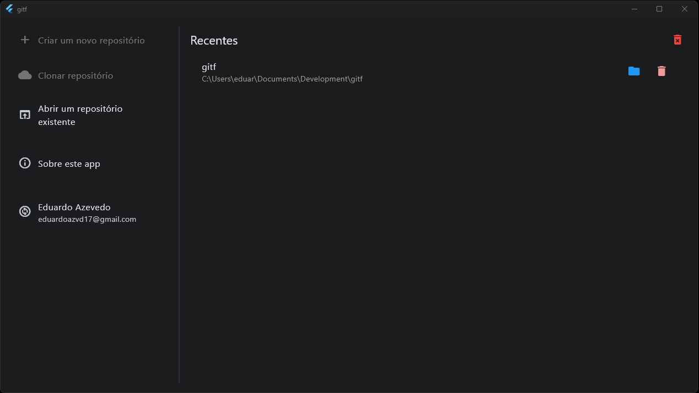
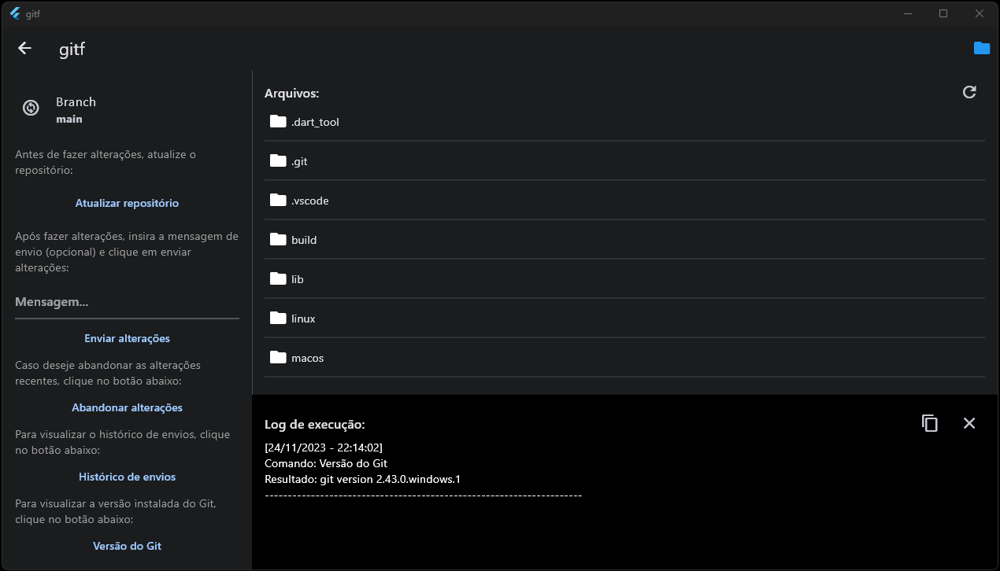

# GitF

Um gerenciador de repositórios Git para iniciantes. 
Esse projeto foi criado apenas para testar o desenvolvimento de apps desktop com o Flutter.

## Tecnologias utilizadas

Pra esse projeto optei por utilizar StatefullWidgets, visto que é algo bem simples e prático pra se utilizar pacotes de gerencia de estado e injeção de dependências. Já os packages, estou utilizando: 
- file_picker - Para selecionar diretórios.
- shared_preferences - Para o armazenamento de dados locais.
- open_dir - Para abrir o diretório selecionado.
- process_run - Para a execução dos comandos Git.
- url_launcher - Para a abertura de links externos.

## Capturas de tela

### Tela inicial

	

### Repositório selecionado

    

